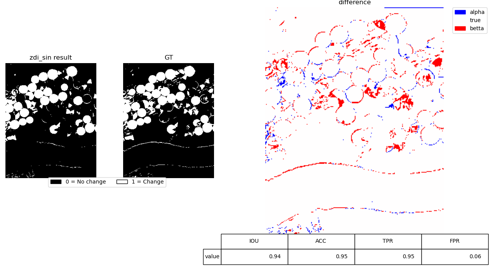

## Change detection

 

>## **Description:**

This project processes Hyperion hyperspectral imagery to detect land-cover changes in the USA region. The workflow integrates spectral and statistical methods to generate change detection maps. The pipeline is divided into four main parts:

1. **Image difference (ID):**

    - Compute pixel-wise changes by subtracting the "before" image from the "after" normalized image.
    - For each pixel, calculate the norm across all spectral bands to measure the magnitude of change.
    - Apply a threshold (determined by trial and error) to generate a binary change map. 

2. **Spectral Angle Mapper (SAM):**

    - Calculates the spectral similarity between corresponding pixels using the spectral angle.
    - Angles greater than a defined threshold are classified as "changed."

3. **Modified Z-score (ZDI):**

    - For each spectral band, compute the mean and standard deviation of the difference image.
    - Apply modified Z-score normalization to standardize the differences across bands. This enhances subtle spectral variations and highlights potential change pixels.

4. **Hybrid Approaches (SAM-ZDI):**

    - Combines SAM angle with ZDI using trigonometric transformations.Multiplies ZDI by the sine and tangent of the SAM angle
    - Produces refined binary change maps for improved detection. These hybrid methods enhance change detection by combining spectral similarity (SAM) with statistical variation (ZDI).


> ## **Class ChangeDetection**

**Methods**

1. **__init__** 
    (self,before,after,gt, data_name,thr_dict):

    Initialize ChangeDetection object.

    - **Parameters**:
        - `self`: Refers to the instance of the class this method belongs to.
        - `before` (np.ndarray): image before change (H x W x D).
        - `after` (np.ndarray):image after change (H x W x D).
        - `gt` (np.ndarray): ground truth change map (H x W).
        - `data_name` (str): name of the dataset for labeling.


2. **normalization**

    - **How the function works**:

        This method apply normalization on before and after hyperspectral data.

        Detailed Steps:

        - Reshape the before and after images from 3D arrays (H × W × D) into 2D arrays (N × D).
        - Concatenate the reshaped before and after images into a single array to compute a consistent normalization across both time points.

    - **Returns**: 
        - `before`(np.ndarray): Normalized flattened.
        - `after`(np.ndarray): Normalized flattened.


3. **sam**

    - **How the function works**:

        This method applies the Spectral Angle Mapper (SAM) algorithm to detect changes between the "before" and "after" hyperspectral images.

        Detailed Steps:

        - Derive the spectral angle in radians using the arccosine of the normalized dot product.
        - Compare the computed angle against a predefined threshold.

    - **Returns**: 
        - `sam`(np.ndarray): Binary change map.
        - `angle`(np.ndarray): Computed spectral angle values.


4. **ID**

    - **How the function works**:

        This method applies the Image Difference (ID) technique for change detection by computing the Euclidean distance between the "before" and "after" images at the pixel level. The magnitude of the difference is then compared against a threshold to classify pixels as changed or unchanged.

        Detailed Steps:

        - For each pixel and each band, compute the difference.
        - For each pixel, calculate the Euclidean norm of its difference vector across all bands.
        - Compare the magnitude with a predefined threshold.

    - **Returns**: 
        - `id_matrix`(np.ndarray): Pixel-wise difference values.
        - `binary_change_from_id`(np.ndarray): Binary change map.


5. **modified_z_score**

    - **How the function works**:

        This method computes the Modified Z-score (ZDI) of the image difference to highlight subtle spectral variations between the "before" and "after" images. By standardizing differences across all bands, ZDI enhances small but significant changes that may not be captured by simple differencing.

        Detailed Steps:

        - For each spectral band Compute the mean and standard deviation of pixel differences and Calculate the squared Z-score for each pixel.
        $$Zscore^2 = \left(\frac{x - \mu}{\sigma}\right)^2$$
        - Accumulate these values across all bands for each pixel.
        - Normalize the accumulated Z-score values.

    - **Returns**: 
        - `normalized_zscore`(np.ndarray): Normalized ZDI map.


6. **sam_zdi**

    - **How the function works**:

        This method combines the Spectral Angle Mapper (SAM) results with the Modified Z-score (ZDI) values to form hybrid change detection indices. By applying trigonometric transformations (sine and tangent), it enhances sensitivity to both spectral similarity and statistical variation.

        Detailed Steps:

        - For each pixel Multiply the ZDI value by the sine of the SAM angle and Multiply the ZDI value by the tangent of the SAM angle.
        $$\text{SAM-ZDI}_{\sin} = \sin(\theta) \times \text{ZDI}$$
        $$\text{SAM-ZDI}_{\tan} = \tan(\theta) \times \text{ZDI}$$
        - Apply thresholds to generate binary change map.

    - **Returns**: 
        - `sam_zdi_sin`(np.ndarray): Binary change map using sine weighting.
        - `sam_zdi_tan`(np.ndarray): Binary change map using tangent weighting.

7. **plot_predict**

    - **How the function works**:

        This method visualizes the predicted change map alongside the ground truth and their difference, and computes standard evaluation metrics from the confusion matrix. It creates a three-panel figure (Result, GT, Difference) and a metrics table (IoU, ACC, TPR, FPR).

        Detailed Steps:

        - Reshape the ground truth to a column vector (H·W × 1) and compute the confusion matrix.
        - Compute metrics (Accuracy, IOU,TPR,FPR)
        - Create a difference map dif = gt - result and reshape to (H × W) for visualization.

    - **Returns**: 
        This function does not return a value; it displays the plots and prints metric summaries.

8. **main**

    - **How the function works**:

        This method serves as the entry point for running the entire change detection workflow. It sequentially calls all implemented methods (`normalization`, `SAM`, `ID`, `Modified Z-score`, `SAM-ZDI`) and visualizes their results using `plot_predict`.

    - **Returns**: This method doesn't return anything but save the pansharped images in corresponding folders by calling the `pansharp_output` method.


> ## **Usage**  

1. **Set the Root Path:**

    Provide the correct root directory of dataset in your script.

2. **Install Dependencies:**

    Before running the script, install all the required dependencies.

Example Usage:
````python
chnage_detection = ChangeDetection(before,after,gt,name,value)
chnage_detection.main()
````  
---